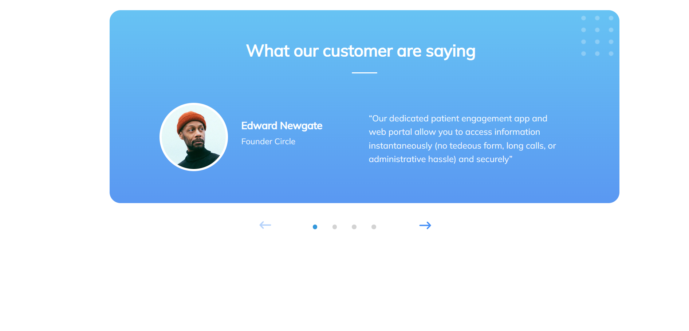
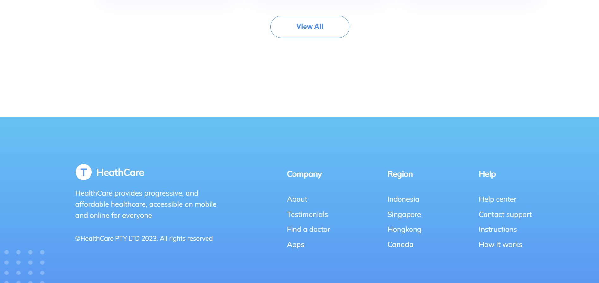

# ReactScreen

В данном проекте представлен экран, реализованный с помощью React + TypeScript + Vite.

### Скриншоты

<table>
    <tr>
        <td></td>
    </tr>
    <tr>
      <td></td>
    </tr>
    <tr>
      <td></td>
    </tr>
    <tr>
      <td></td>
    </tr>
</table>

### Технологии

- npm 10.2.3
- NodeJs 20.10.0
- React 18.2.0
- TypeScript 5.2.2
- Vite 5.0.8
- Приложение разрабатывалось в Visual Studio Code

### Запуск проекта

Для запуска проекта нужно зайти в командную строку, и через нее в папке с клонированным проектом прописать "npm install". После чего для запуска сервера используется команда "npm run dev".

